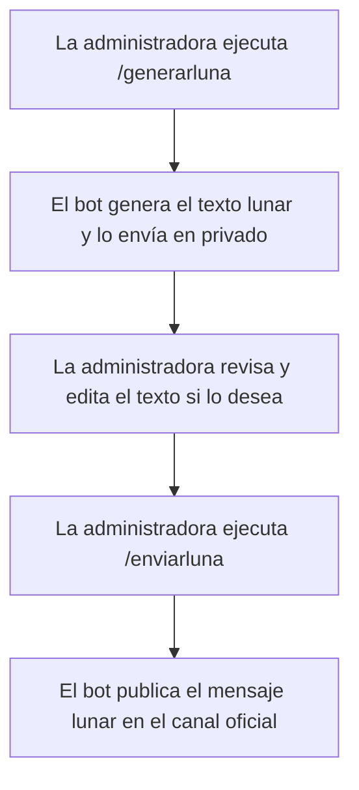

# LUN.IA Telegram Bot

Un bot de Telegram que te acompaña con información sobre la fase lunar actual, recomendaciones, rituales, citas y tips lunares, todo en español. Ideal para bienestar, ciencia y desarrollo personal.

## Funcionalidades
- Consulta la fase lunar actual en español
- Recibe una recomendación, ritual, cita y tip aleatorio según la fase
- Calcula los días hasta la próxima Luna Nueva
- Todo el contenido es editable fácilmente desde una base de datos JSON
- Registra tus notas diarias de proyecto y consulta tu historial de logros
- Obtén meditaciones, mantras y conjuros personalizados para cada fase lunar y tema
- Contacta con la creadora para guía personalizada
- Los comandos principales aparecen como botones interactivos en Telegram

## Comandos principales

- `/luna` – Mensaje lunar del día
- `/anotar` – Registrar avance, idea o logro
- `/logros` – Ver historial de notas
- `/meditacion [tema]` – Inspiración personalizada (ej: proyectos, amor, creatividad)
- `/mantra [tema]` – Mantra lunar
- `/conjuro [tema]` – Conjuro lunar
- `/contacto` – Contactar o info
- `/intro` – Información sobre el bot
- `/cancelar` – Cancelar anotación
- `/lunarhoy` – Reenviar mensaje lunar del día (solo admin)
- `/enviarluna` – Enviar mensaje lunar al canal (solo admin)
- `/generarluna` – Generar texto lunar para revisión (solo admin)

Los comandos de administración solo pueden ser usados por la creadora (@divae).

## Cómo usar los comandos de administración

- **/generarluna**: Genera el texto del mensaje lunar diario y lo envía solo a la administradora en privado. Útil para revisar y modificar el mensaje antes de publicarlo.
- **/enviarluna**: Envía el mensaje lunar diario al canal oficial (@lun_ia_oficial). Solo la administradora puede usarlo. Se recomienda usar primero /generarluna para revisar el texto.
- **/lunarhoy**: Permite reenviar el mensaje lunar del día en privado, solo para pruebas de la administradora.

## Flujo de publicación manual del mensaje lunar diario



## Inicio rápido

1. **Clona el repositorio**
   ```bash
   git clone https://github.com/divae/lun_ia.git
   cd lunia-bot
   ```

2. **Instala las dependencias**
   ```bash
   pip install -r requirements.txt
   ```

3. **Configura tu token de Telegram**
   - Crea un archivo `.env` en el directorio `lunia-bot`:
     ```
     TELEGRAM_TOKEN=tu_token_aqui
     ```
   - **Nunca compartas tu token real ni subas `.env` a GitHub!**
   - Puedes usar `.env.example` como plantilla.

4. **Ejecuta el bot**
   ```bash
   python bot.py
   ```

5. **Pruébalo en Telegram**
   - Abre tu bot en Telegram y envía `/luna` para recibir el mensaje lunar.
   - Después de cada mensaje lunar, el bot te invitará a anotar tu avance, idea o logro.
   - Usa los botones o comandos para acceder a todas las funciones.

## Estructura del proyecto

```
lunia-bot/
├── bot.py           # Código principal del bot
├── moon_data.json   # Base de datos de recomendaciones, rituales, citas y tips
├── rituals_db.json  # Meditaciones, mantras y conjuros por fase y tema
├── user_notes.json  # Notas y logros de usuarios (se genera automáticamente)
├── requirements.txt # Dependencias de Python
├── .env             # Token secreto (¡no subir!)
├── .env.example     # Ejemplo de archivo de entorno
├── README.md        # Esta documentación
```

## Notas personales y logros
- Tras cada mensaje lunar, el bot te invita a anotar tu avance, idea o logro.
- Usa `/anotar` para añadir una nota en cualquier momento. Puedes cancelar con `/cancelar`.
- Todas las notas se guardan en `user_notes.json` (privado, no compartido).
- Usa `/logros` para ver tus últimas 10 notas, con fecha y fase lunar.

## Meditaciones, mantras y conjuros
- Usa `/meditacion [tema]` para recibir una meditación adaptada a la fase lunar y tema elegido.
- Usa `/mantra [tema]` para recibir un mantra para el día y tu tema.
- Usa `/conjuro [tema]` para recibir un conjuro sencillo y seguro para tu intención.
- Si no especificas tema, el bot usará uno por defecto (ej: proyectos o protección).
- Ejemplo:
  - `/meditacion proyectos`
  - `/mantra amor`
  - `/conjuro abundancia`

## Contacto
- Usa `/contacto` para contactar con la creadora para guía personalizada, inspiración lunar o dudas.
- Contacto vía Telegram: [@divae](https://t.me/divae)
- **Transparencia:** Todas las recomendaciones, meditaciones y rituales combinan experiencia personal, intuición y herramientas de inteligencia artificial para ofrecerte inspiración adaptada a cada fase lunar y a tu camino personal.

## Seguridad: Mantén tu token seguro
- El token de Telegram debe estar en `.env` y **nunca** subirse a GitHub.
- `.env` está incluido en `.gitignore` por defecto.
- Comparte `.env.example` para que otros sepan qué variable necesitan.

## Personaliza el contenido
- Edita `moon_data.json` para añadir o cambiar recomendaciones, rituales, citas y tips para cada fase lunar.
- Edita `rituals_db.json` para añadir o cambiar meditaciones, mantras y conjuros para cada fase y tema.
- ¡No necesitas modificar el código para actualizar el contenido!

## Problemas comunes
- **El bot dice `TELEGRAM_TOKEN is not set in the environment.`**
  - Asegúrate de que `.env` existe en el directorio `lunia-bot` y está bien escrito.
  - Ejecuta el bot desde el directorio correcto.
- **FileNotFoundError para `moon_data.json` o `rituals_db.json`**
  - Asegúrate de que ambos archivos están en el mismo directorio que `bot.py`.
- **No responde en Telegram**
  - Verifica que el bot está corriendo y el token es correcto.

## FAQ
**¿Puedo añadir más tips, meditaciones, mantras o conjuros?**  
¡Sí! Solo edita los archivos JSON y reinicia el bot.

**¿Cómo mantengo mi token secreto?**  
Nunca compartas tu `.env`. Usa `.env.example` para documentar.

**¿Puedo ejecutarlo en un servidor?**  
Sí, solo asegúrate de tener Python, las dependencias y el `.env`.

## Contribuir
- Haz fork del repo y envía un pull request.
- ¡Sugerencias, bugs y mejoras son bienvenidas!

## Licencia
MIT 